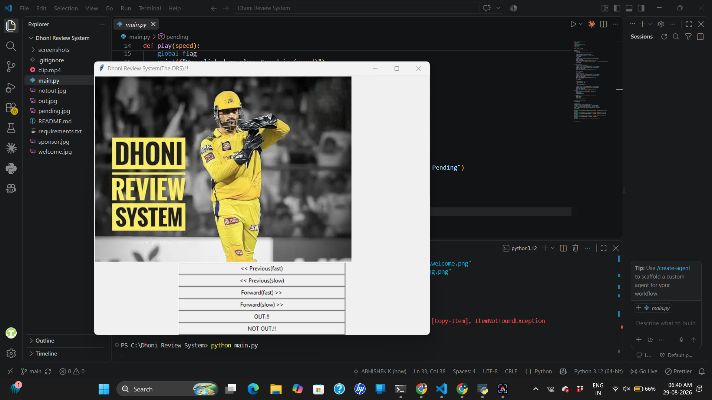
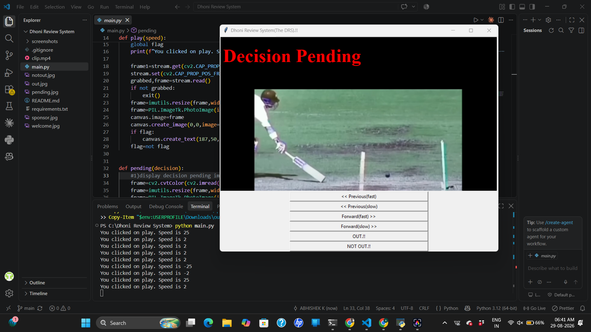
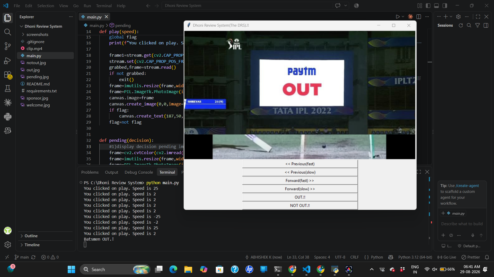
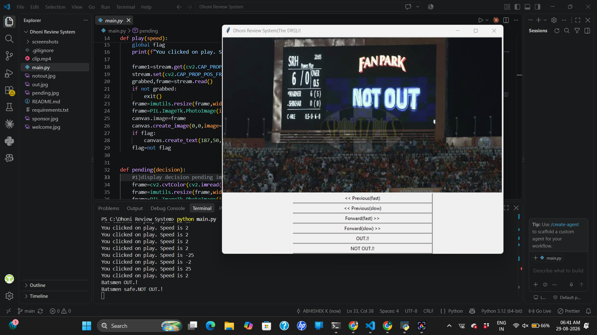

# 🏏 Dhoni Review System (DRS)

A Python-based **Cricket Decision Review System (DRS) simulation** that recreates the basic workflow of a cricket review using video playback, frame navigation, decision-pending screens, and OUT/NOT OUT decision controls.

The project was built as a desktop application using Python, OpenCV, Tkinter, and Pillow.

---

## 📸 Application Preview

### Welcome Screen


### Decision Pending


### OUT Decision


### NOT OUT Decision


---

## 🚀 Features

- 🎥 Cricket video playback
- ⏪ Previous frame navigation
- ⏩ Forward frame navigation
- 🐢 Slow playback controls
- ⚡ Fast playback controls
- ⏳ Decision Pending screen
- 📺 Review/sponsor transition
- ❌ OUT decision display
- ✅ NOT OUT decision display
- 🖥️ Interactive desktop GUI
- 🎞️ Frame-based video navigation using OpenCV

---

## 🛠️ Technologies Used

| Technology | Purpose |
|---|---|
| Python | Core application logic |
| OpenCV | Video processing and frame navigation |
| Tkinter | Graphical user interface |
| Pillow | Image processing and GUI image rendering |
| imutils | Image/video utility operations |

---

## 📂 Project Structure

```text
Dhoni-Review-System/
│
├── main.py
├── clip.mp4
├── requirements.txt
├── .gitignore
├── README.md
│
├── welcome.jpg
├── pending.jpg
├── sponsor.jpg
├── out.jpg
├── notout.jpg
│
└── screenshots/
    ├── welcome.png
    ├── decision-pending.png
    ├── out.png
    └── notout.png


    ⚙️ How It Works

The application simulates a simplified cricket DRS workflow:

Start Application
       ↓
Load Cricket Video
       ↓
Navigate Through Frames
       ↓
Review the Playing Sequence
       ↓
Decision Pending
       ↓
Select Decision
   ↙           ↘
 OUT         NOT OUT

The video is processed frame-by-frame using OpenCV, allowing the user to move through the footage at different speeds.

💻 Installation
1. Clone the repository
git clone https://github.com/abhishekk-1804/Dhoni-Review-System.git
2. Open the project directory
cd Dhoni-Review-System
3. Install dependencies
pip install -r requirements.txt
4. Run the application
python main.py
🎮 Controls

The application provides controls for:

Previous (Fast) — Move backward quickly through the video
Previous (Slow) — Move backward slowly
Forward (Fast) — Move forward quickly
Forward (Slow) — Move forward slowly
OUT!! — Display the OUT decision
NOT OUT!! — Display the NOT OUT decision
🎯 Use Cases

Although this project is a simulation rather than an official cricket DRS implementation, it demonstrates concepts useful for:

🎥 Sports video analysis
🖼️ Frame-by-frame video processing
🖥️ Desktop GUI development
⚙️ Event-driven programming
📹 Computer vision fundamentals
🏏 Cricket technology simulations
🎓 Learning OpenCV and Tkinter
📚 Learning Outcomes

This project provided practical experience with:

Reading and processing video using OpenCV
Accessing individual video frames
Controlling video playback speed
Building an interactive Tkinter interface
Displaying images inside GUI applications
Connecting GUI events with application logic
Organizing dependencies using requirements.txt
Managing a Python project with Git and GitHub
⚠️ Disclaimer

This project is an educational simulation and is not an official cricket Decision Review System.

It does not perform automated ball-tracking, edge detection, ball-impact analysis, or Hawk-Eye-style trajectory prediction.

The displayed decisions are controlled through the application's interface.

👨‍💻 Author

Abhishek K Doddagooudar

GitHub: abhishekk-1804

⭐ If you found this project useful

Feel free to explore the source code, experiment with the playback controls, and build upon the project.
